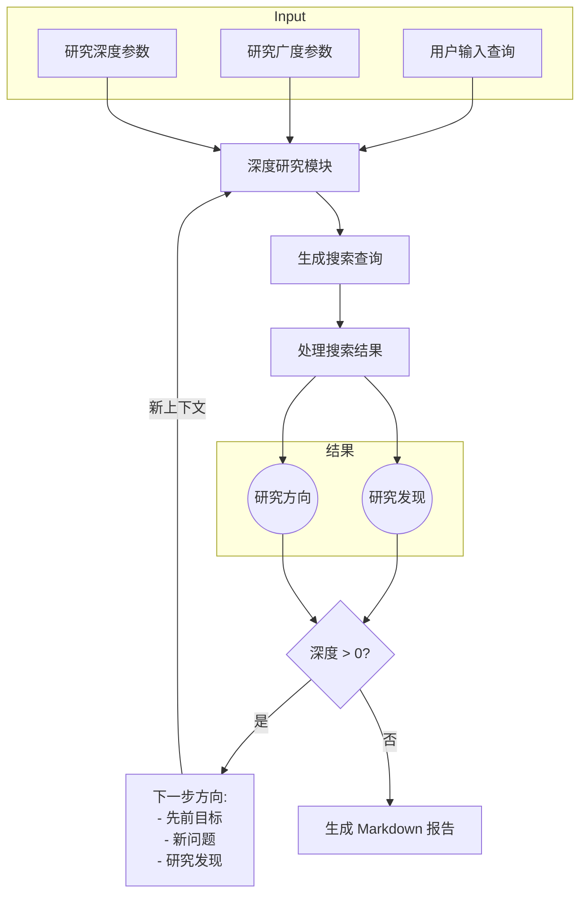
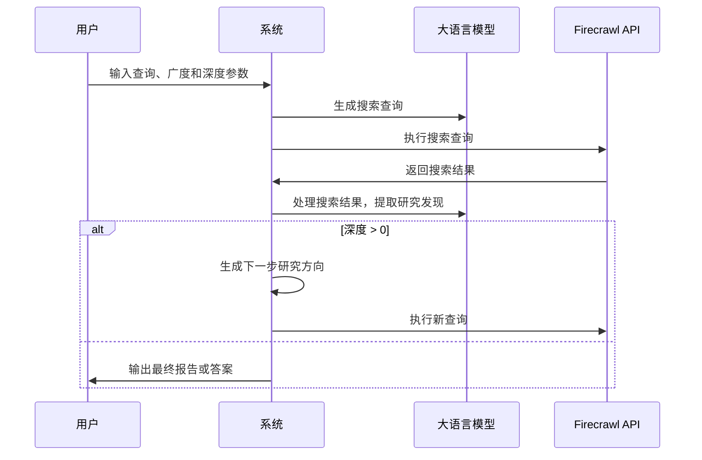
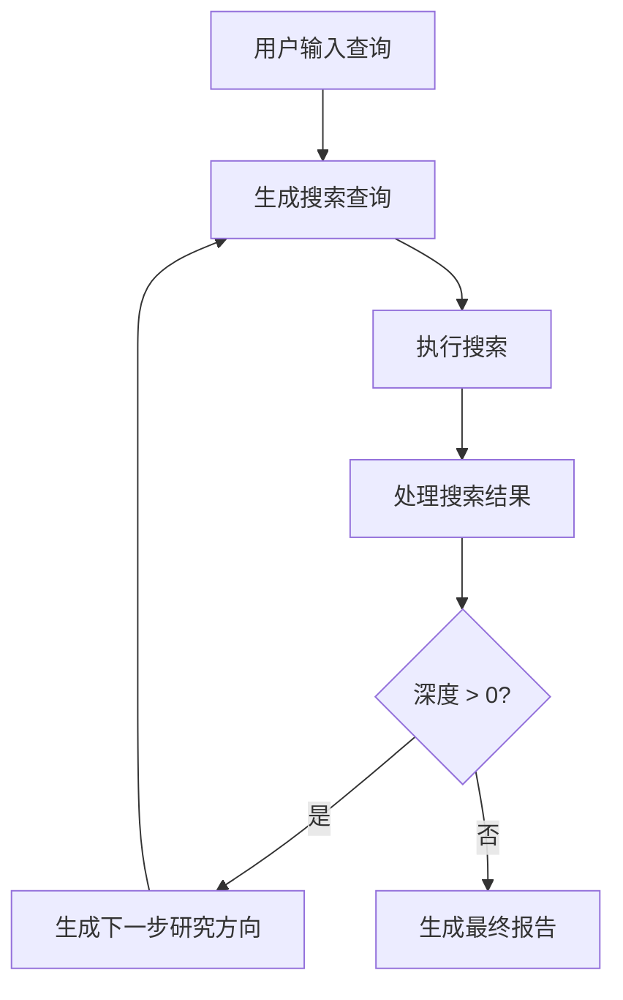

# 系统分析文档

## 1. 系统描述

### 系统摘要
本系统是一个基于 AI 的深度研究助手，能够通过结合搜索引擎、网页抓取和大语言模型（LLM）进行迭代式深度研究。用户可以输入研究主题，系统会生成搜索查询、处理结果并根据发现进一步深入研究，最终生成详细的 Markdown 报告或简洁的答案。

### 系统架构图


### 系统流程图


---

## 2. 模块分析

### 2.1 深度研究模块 (`deep-research.ts`)

#### 描述
该模块是系统的核心，负责执行深度研究逻辑，包括生成搜索查询、处理搜索结果、递归研究和生成最终报告。

#### 流程图


#### 实现关键细节
- **并发控制**：使用 `p-limit` 限制并发搜索请求数量。
- **递归研究**：通过递归调用 `deepResearch` 方法实现多层次研究。
- **结果处理**：调用 `processSerpResult` 提取研究发现和后续问题。

#### 改进建议
- **错误处理**：当前错误处理较为简单，仅记录日志，建议对不同类型的错误采取不同的恢复策略。
- **配置灵活性**：将 `ConcurrencyLimit` 和超时参数提取到配置文件中，便于调整。

---

### 2.2 搜索查询生成模块 (`generateSerpQueries`)

#### 描述
负责根据用户输入和研究发现生成搜索引擎查询。

#### 实现关键细节
- 使用 LLM 生成查询，确保查询的多样性和针对性。
- 支持根据已有研究发现生成更具体的查询。

#### 改进建议
- **查询优化**：增加对查询关键词的去重和排序逻辑。
- **多语言支持**：支持生成非英语查询以扩展研究范围。

---

### 2.3 搜索结果处理模块 (`processSerpResult`)

#### 描述
负责解析搜索结果，提取研究发现和后续问题。

#### 实现关键细节
- 使用 `trimPrompt` 限制内容长度，确保符合 LLM 的上下文限制。
- 提取实体、数字和日期等关键信息。

#### 改进建议
- **性能优化**：对大文本内容增加缓存机制，减少重复处理。
- **边界条件处理**：增加对空结果的处理逻辑。

---

### 2.4 报告生成模块 (`writeFinalReport` 和 `writeFinalAnswer`)

#### 描述
根据研究发现生成最终的 Markdown 报告或简洁答案。

#### 实现关键细节
- 报告包含所有研究发现和来源链接。
- 答案根据用户指定格式生成，确保简洁和准确。

#### 改进建议
- **格式灵活性**：支持更多输出格式（如 PDF 或 HTML）。
- **内容校验**：增加对生成内容的校验逻辑，确保准确性。

---

### 2.5 用户交互模块 (`run.ts`)

#### 描述
负责与用户交互，获取输入参数并展示研究结果。

#### 实现关键细节
- 使用 `readline` 获取用户输入。
- 支持生成报告和答案两种模式。

#### 改进建议
- **用户体验**：增加输入参数的默认值提示和校验。
- **国际化支持**：支持多语言交互。

---

## 3. 使用示例

### 示例 1：生成研究报告
```bash
npm start
```
输入以下内容：
- 查询：`What are the latest advancements in AI?`
- 广度：`3`
- 深度：`2`
- 模式：`report`

系统将生成一份包含研究发现和来源链接的 Markdown 报告，并保存为 `report.md`。

### 示例 2：生成简洁答案
```bash
npm start
```
输入以下内容：
- 查询：`What is the capital of France?`
- 广度：`1`
- 深度：`1`
- 模式：`answer`

系统将生成一个简洁答案，并保存为 `answer.md`。

---

## 4. 总结

本系统通过模块化设计实现了高效的深度研究功能，适用于多种研究场景。未来可以通过以下方式进一步优化：
- 增强错误处理和边界条件处理。
- 提高配置灵活性和用户体验。
- 支持更多输出格式和多语言功能。
```
